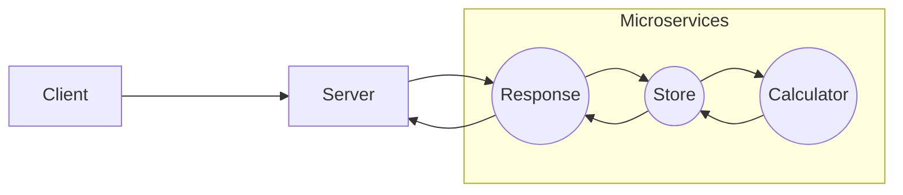

# Calculadora via Microsserviços

Uma aplicação desenvolvida na disciplina de COM242.1 - SISTEMAS DISTRIBUÍDOS da UNIFEI.\
O objetivo a ser realizado era:

    1. Resposta a uma mensagem de texto;
    2. Alterações em um arquivo texto;
    3. Cálculo de uma função.

Sendo assim, desenvolvemos uma calculadora, (totalmente didática), na arquitetura de microsserviços.\
Para a realização deste projeto, utilizamos os protocolos síncronos HTTP e REST.

## Como executar

Em cada diretório raiz de microsserviço ou servidor, você pode usar a chamada de script:

### `npm start`

Inicia o processo da aplicação. É dito no console qual o IP e porta de escuta.

### `npm run dev`

O mesmo que o anterior, mas, em casos de modificações, automaticamente reinicia a aplicação.

## Configuração

### `.env`

Cada microsserviço tem um arquivo ".env", que define a variável de ambiente PORT.\
A aplicação "server" usa a variável RESPONSE_MICROSERVICE, que define o ip e porta deste microsserviço.\
Esse arquivo deve ser localizado no diretório raiz de cada aplicação.

### `file.json`

Além disso, o microsserviço "store" também utiliza um "file.json", para a execução de modificações em arquivo.\
Deve ser localizado na pasta "public". Este microsserviço é o único que deve ter algo do tipo.\
Se a pasta ou arquivo não forem criados previamente, isto acontecerá na execução.

## Ideia

A aplicação "server" servirá de interface para o cliente.\
Ela conversa diretamente com o microsserviço "response".

O microsserviço "response" envia o resultado para o "server".\
A resposta esperada é uma string.

O microsserviço "store" guarda as informações de contas já realizadas.\
Estas informações são mantidas em "public/file.json" como "expressão:resultado".

O microsserviço "calculation" realiza a conta.\
A resposta esperada é uma string, podendo ser a conta realizada ou uma mensagem de erro.

## Implementação da arquitetura

Não usaremos um orquestrador, todos os microsserviços saberão exatamente o endereço do outro.\
Não há necessidade para a existência de um banco de dados.

### `server`

O "server" repassará para o microsserviço "response" a expressão que deseja ser calculada.\
Não há necessidade de validação, caso esteja fora do padrão, os microsserviços saberão tratá-las.

### `microservice response`

Após o recebimento, este microsserviço encaminhará a requisição para o microsserviço "store".\
Ao receber o resultado da expressão, ele responderá o "server" com uma string.\
Esta string pode ser tanto o resultado como uma mensagem de erro. Ambas serão repassadas para o usuário.

### `microservice store`

Checando o arquivo .json interno, ele irá ver se já existe o resultado da expressão.\
Caso exista, ele o retornará para o microsserviço "response".

Senão, ele enviará a expressão para o microsserviço "calculation" e aguardará o resultado.\
Após o recebimento, ele irá repassar a resposta e atualizar o seu arquivo .json.\
A atualização só será realizada em caso de sucesso.

### `microservice calculation`

Após o recebimento da expressão, este microsserviço a calculará.\
Calculando-a, ele a retornará para o microsserviço "store".\
A resposta é uma string, dizendo se a entrada é inválida ou, em caso de sucesso, o resultado em questão.

## Diagrama

Ilustrando o processo descrito anteriormente:

